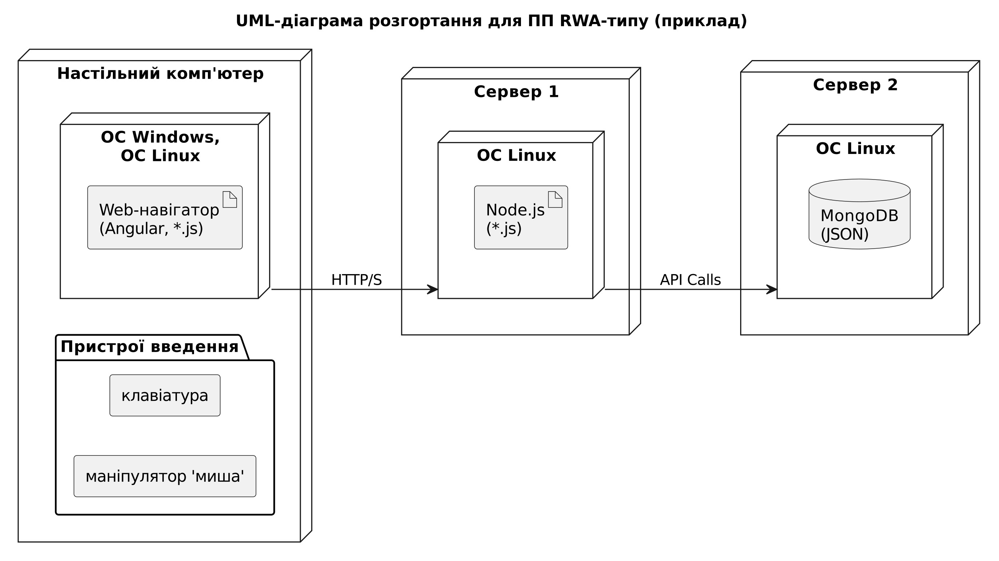
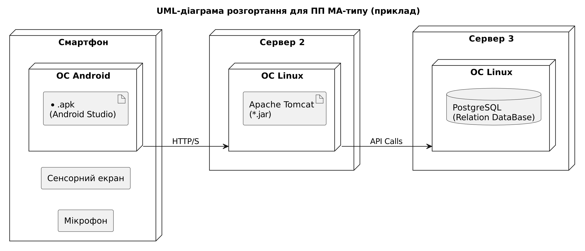

### Архітектура програмного продукту

У цій частині представлено UML‑діаграму розгортання, що ілюструє архітектурний тип нашого програмного продукту та описує компоненти трьох рівнів:

- **Presentation Layer (PL):** Компоненти інтерфейсу користувача (наприклад, настільний додаток або мобільний додаток).
- **Business Logic Layer (BL):** Компоненти бізнес-логіки, що забезпечують виконання основних функцій.
- **Application/Data Access Layer (AL):** Компоненти доступу до даних та інтеграції з базами даних.

Кожен компонент детально описаний з урахуванням особливостей реалізації, таких як операційна система, технології розробки, СУБД, тип структур даних та апаратні засоби.

## 1. UML-діаграма розгортання для RWA-типу

Ця діаграма відображає розгортання компонентів для архітектури RWA-типу, де показано, як взаємодіють апаратні та програмні компоненти, зокрема:
- **Аппаратна частина:** настільний комп'ютер, сервери.
- **Програмна частина:** операційні системи, веб-навігатор, бази даних тощо.

## 2. UML-діаграма розгортання для MA-типу

Ця діаграма демонструє розгортання для архітектури MA-типу, де основна увага приділяється мобільному застосунку та серверним компонентам, що забезпечують взаємодію через API.

## UML-діаграма розгортання

Нижче наведено посилання на raw-версію PlantUML-файлу розгортання:

