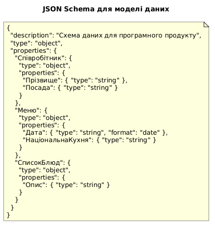
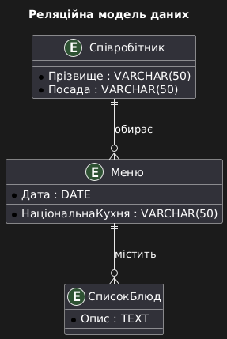

# Логическая модель даных

## Реляционная модель
Ниже приведена UML-диаграмма, описывающая реляционную модель данных:

## JSON-модель
Ниже приведена UML-диаграмма, описывающая JSON Schema модели:

