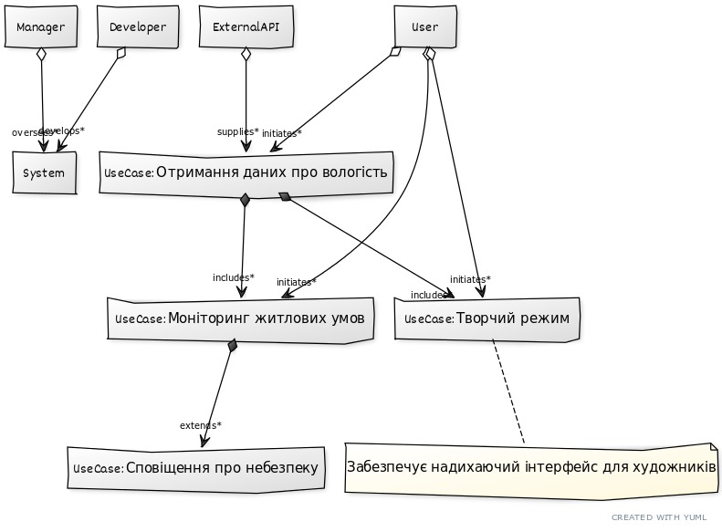

### UML-діаграма прецедентів програмного продукту

Нижче наведено UML-діаграму прецедентів, що відображає взаємодію між акторами та прецедентами:

# UML‑діаграма прецедентів

Нижче наведено посилання на raw‑версію PlantUML‑файлу:

